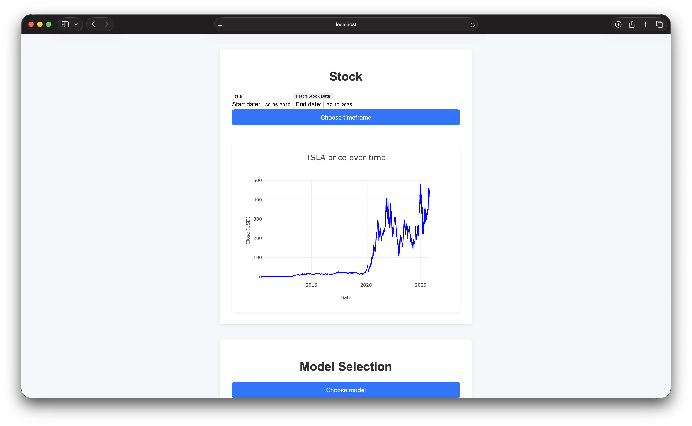
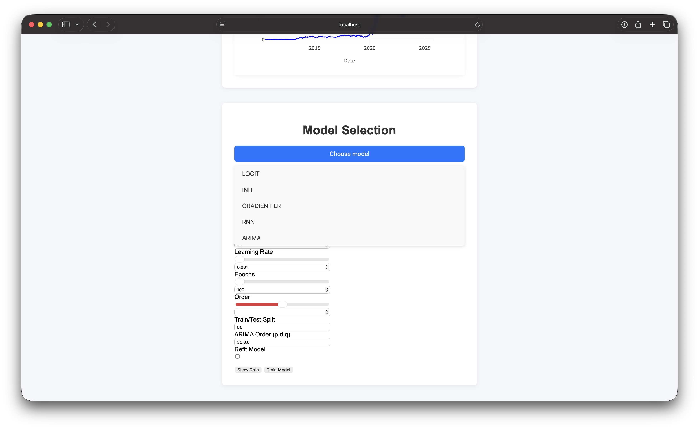
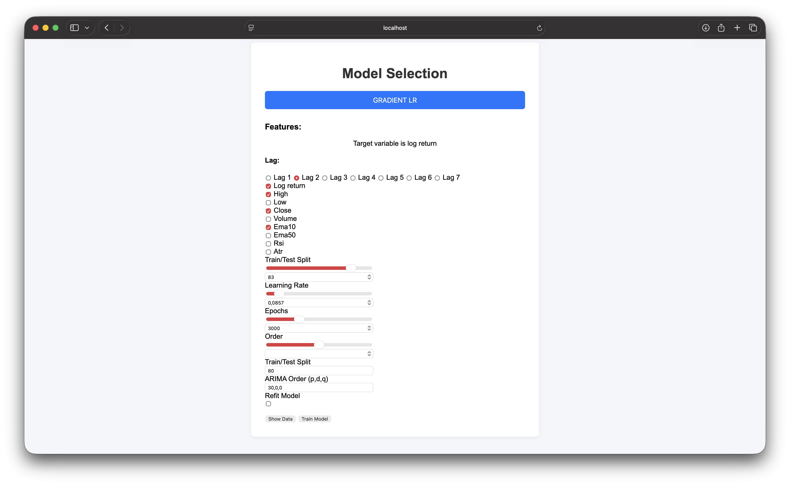
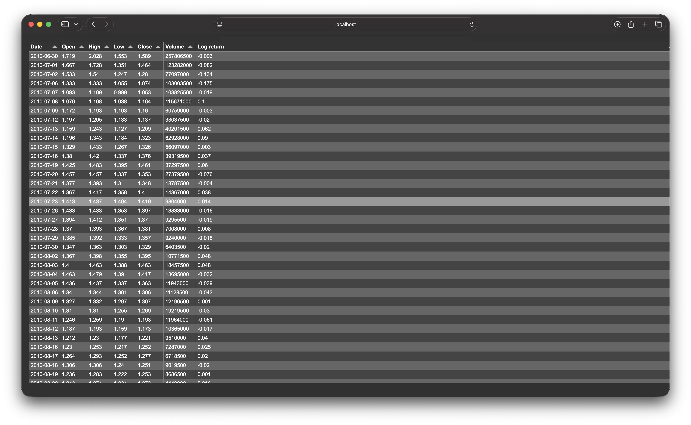

# Project Documentation `model_app`
- ! THIS PROJECT IS CURRENTLY IN-PROGRESS - SOME FEATURES AREN'T IMPLEMENTED YET.
- CSS isn't fully done aswell

- This project creates website, where user can fetch live financial data for pleasured stock ticker, then choose statstical or machine learning model, tune according hyperparameters and watch how model performs in these conditions.
- Website should enable user to try and train different models with different features only by clicking - no programming needed.
- User can tweak parametrs of stock data aswell - choose freqency (1 day, 1 week, 1 month, 3 months), start/end time
- There is graph overview of Close stock price - which is then the target variable in its log return form
- User can browse fetched data, created features in their wished lag.

- Visualization of loss function (probably MSE) is planned, aswell as providing numbers for different predictions evaluations for train and test set
- There will be new section with these metrics and trained model parameters and so on
- Leaderboard of best models is planned
- More models are planned


## Tools used
- Python (Pandas, Numpy, Statsmodels, Tensorflow, Flask, yfinance - Yahoo finance API)
- JS (Chart.js, Tabulator.js)
- HTML, CSS


## Installation

Create Conda environment from `environment.yml`:

```bash
conda env create -f backend/environment.yml
conda activate <environment_name>
```


## Running the website
```
cd backend/
python main.py
```
Backend runs at http://localhost:5055
Debug mode is currently enabled (debug=True)
```
cd frontend/
python -m http.server
```
Then go to http://localhost:5055 on your favorite browser


## Screenshots





